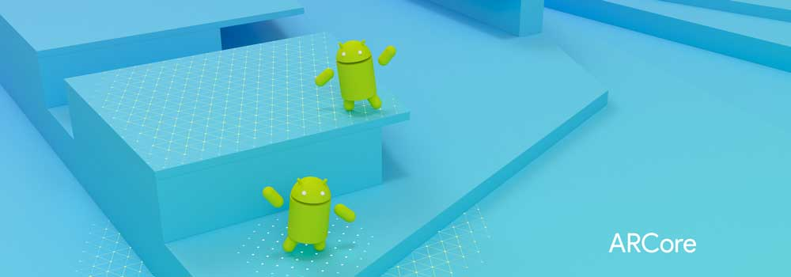

# Awesome ARCore  

>A curated list of awesome ARCore projects and resources. Feel free to contribute!

*Please read the [contribution guidelines](contributing.md) before contributing.*

- [ARCore](#arcore)
- [Projects](#projects)
- [Forum / Threads](#forum-threads)
- [Tutorials](#tutorials)
    - [Android Studio](#android-studio)
    - [Unity](#unity)
    - [Unreal](#unreal)

---

## ARCore

ARCore is a platform for building augmented reality apps on Android. ARCore uses three key technologies to integrate virtual content with the real world as seen through your phone's camera:

* **Motion tracking** allows the phone to understand and track its position relative to the world.
* **Environmental understanding** allows the phone to detect the size and location of flat horizontal surfaces like the ground or a coffee table.
* **Light estimation** allows the phone to estimate the environment's current lighting conditions.

## Forum / Threads
- [Unity Forum Thread](https://forum.unity3d.com/threads/introducing-arcore-an-android-ar-sdk-for-unity.490929/) - Unity Forum thread for ARCode.

## Projects

## Tutorials

### Android Studio
- [Android Studio getting started](https://developers.google.com/ar/develop/java/getting-started) - Android Studio getting started guide.

### Unity
- [Unity getting started](https://developers.google.com/ar/develop/unity/getting-started) - Unity getting started guide.

### Unreal
- [Unrealgetting started](https://developers.google.com/ar/develop/unreal/getting-started) - Unreal getting started guide.

--- 
**License**

To the extent possible under law, [Chathu Vishwajith](https://chathu.me) has waived all copyright and related or neighboring rights to this work.

